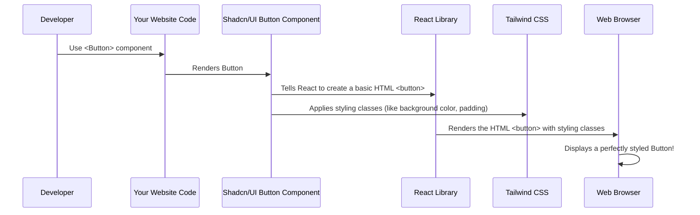

# Chapter 1: Frontend UI Components (Shadcn/UI Library)

Imagine you're building a magnificent ship (our `heritage-shipping-ltd` website!). You wouldn't carve every single plank and nail from scratch, would you? You'd use pre-made, high-quality pieces that fit together perfectly.

That's exactly what **Frontend UI Components** are for our website's user interface (UI) – the parts you see and interact with, like buttons, forms, and pop-up windows. Instead of spending time designing every little detail of a button, making sure it looks good, and behaves correctly, we use "pre-built LEGO bricks" provided by a library called **Shadcn/UI**.

### Why Use These "LEGO Bricks"?

Building a website involves many common elements:
*   **Buttons:** To click things.
*   **Input Fields:** To type in your name or address.
*   **Cards:** To display information neatly.
*   **Pop-up Windows (Dialogs):** To ask for confirmation or show important messages.

If we had to build each of these from scratch every time, it would take a lot of effort and slow us down. Plus, it would be hard to make sure every button or input field across the entire website looks and feels the same.

Shadcn/UI solves this problem by providing a collection of ready-made, beautifully styled, and highly functional UI components. These components are designed to work perfectly with React (the technology we use to build the interactive parts of our website) and are styled using [Tailwind CSS (Utility-First Styling)](02_tailwind_css__utility_first_styling__.md). This ensures our website has a consistent, professional look and feel, and we can build features much faster!

### Our First Task: A Simple Shipping Form

Let's imagine we need to build a simple form for users to enter their name and a message for a shipping inquiry. After they submit, a confirmation pop-up should appear. This task will show us how convenient these UI components are! We'll use three main types of components:

1.  **`Input`**: For users to type text.
2.  **`Button`**: To submit the form.
3.  **`Dialog`**: A pop-up window for confirmation.

### How to Use Frontend UI Components

Using these components is like dropping a ready-made LEGO brick into your build. You just tell it where to go and what basic properties it should have.

Here's how you might use these components in a simplified React code example:

```jsx
import { Input } from "@/components/ui/input";
import { Button } from "@/components/ui/button";
import {
  Dialog,
  DialogTrigger,
  DialogContent,
  DialogHeader,
  DialogTitle,
  DialogDescription,
} from "@/components/ui/dialog";

function ShippingInquiryForm() {
  return (
    <div>
      <Input type="text" placeholder="Your Name" />
      <Button>Send Inquiry</Button>

      <Dialog>
        <DialogTrigger asChild>
          <Button variant="outline">Learn More</Button>
        </DialogTrigger>
        <DialogContent>
          <DialogHeader>
            <DialogTitle>Inquiry Sent!</DialogTitle>
            <DialogDescription>
              Your inquiry has been successfully sent. We will get back to you soon.
            </DialogDescription>
          </DialogHeader>
        </DialogContent>
      </Dialog>
    </div>
  );
}

export default ShippingInquiryForm;
```

**Explanation:**
*   **`import { ... } from "@/components/ui/..."`**: This is how we bring the "LEGO bricks" into our code. Notice the path `components/ui` – this is where all our Shadcn/UI components live within the project.
*   **`<Input type="text" placeholder="Your Name" />`**: This creates a clean input field. We just tell it what `type` of input it is (text) and what `placeholder` text to show inside.
*   **`<Button>Send Inquiry</Button>`**: This creates a styled button with the text "Send Inquiry" inside. Simple!
*   **`<Dialog>`**: This is the main pop-up container.
    *   **`<DialogTrigger asChild>`**: This makes whatever is *inside* it (in this case, another `Button` called "Learn More") act as the trigger to open the dialog.
    *   **`<DialogContent>`**: This is the actual content area of the pop-up.
    *   **`<DialogHeader>`, `<DialogTitle>`, `<DialogDescription>`**: These are more specific components to structure the pop-up's title and descriptive text, keeping it neatly organized.

When this code runs, you'll see a professional-looking input field, a styled button, and if you click the "Learn More" button, a clean pop-up dialog will appear, just like magic!

### What's Under the Hood? (How do these LEGO bricks work?)

You don't need to know every tiny detail to use these components, but understanding the basics helps.

When you use a component like `<Button>`:



Let's look at some simplified parts of the actual component files to see how this happens. You'll find these files in the `components/ui` folder.

#### The Button Component (`components/ui/button.tsx`)

This file defines how our `<Button>` component looks and behaves. It uses something called `cva` (Class Variance Authority) to easily change its appearance based on properties like `variant` (e.g., `default`, `outline`) and `size` (e.g., `sm`, `lg`).

```typescript
// components/ui/button.tsx
import * as React from "react"
import { cva } from "class-variance-authority"
import { cn } from "@/lib/utils" // A helper for combining styles

const buttonVariants = cva(
  "inline-flex ...", // Default styles applied to all buttons
  {
    variants: {
      variant: {
        default: "bg-primary ...", // Styles for default button
        outline: "border border-input ...", // Styles for outline button
      },
      // ... other variants and sizes
    },
    defaultVariants: { variant: "default", size: "default" },
  },
)

const Button = React.forwardRef<HTMLButtonElement, ButtonProps>(
  ({ className, variant, size, asChild = false, ...props }, ref) => {
    // 'cn' combines all the right styling classes
    return <button className={cn(buttonVariants({ variant, size, className }))} ref={ref} {...props} />;
  },
)
Button.displayName = "Button"

export { Button, buttonVariants }
```

**Explanation:**
*   `buttonVariants`: This is where all the different styling rules are defined. For example, a `default` button gets a `bg-primary` (primary background color) style.
*   `Button` component: This is the actual React component we import. It takes properties like `variant` and `size`, uses the `buttonVariants` to pick the right styles, and then applies them to a standard HTML `<button>` element using the `cn` helper. The `cn` helper is important because it intelligently combines different styling rules, which we'll learn more about when we discuss [Tailwind CSS (Utility-First Styling)](02_tailwind_css__utility_first_styling__.md) and [Client-side Utility Hooks (Reusable UI Logic)](03_client_side_utility_hooks__reusable_ui_logic__.md).

#### The Input Component (`components/ui/input.tsx`)

Similarly, the `Input` component wraps a standard HTML `<input>` tag and applies default styling.

```typescript
// components/ui/input.tsx
import * as React from "react"
import { cn } from "@/lib/utils"

const Input = React.forwardRef<HTMLInputElement, React.ComponentProps<"input">>(
  ({ className, type, ...props }, ref) => {
    return (
      <input
        type={type}
        className={cn(
          "flex h-10 w-full rounded-md border border-input bg-background ...", // Default input styles
          className
        )}
        ref={ref}
        {...props}
      />
    )
  }
)
Input.displayName = "Input"

export { Input }
```

**Explanation:**
*   This code creates a standard `<input>` HTML element.
*   The `className` property, combined with `cn`, applies a bunch of styling rules like `h-10` (height 10 units), `w-full` (full width), `rounded-md` (rounded corners), and `border border-input` (a border around the input). These are all [Tailwind CSS (Utility-First Styling)](02_tailwind_css__utility_first_styling__.md) classes.

#### Other Components

The project also uses other components like `Dialog`, `Card`, and `Tooltip`. They follow a similar pattern: they are React components that wrap basic HTML elements or other utility components (often from a library called Radix UI, which provides unstyled components for accessibility) and then apply beautiful styles using [Tailwind CSS (Utility-First Styling)](02_tailwind_css__utility_first_styling__.md).

*   **`components/ui/dialog.tsx`**: Defines the pop-up window.
*   **`components/ui/card.tsx`**: Defines display boxes for content.
*   **`components/ui/tooltip.tsx`**: Defines small pop-ups that appear when you hover over something.

#### The `components.json` File

This file is like the component blueprint for the entire project. It tells our development tools where to find these UI components and how they are configured.

```json
{
  "$schema": "https://ui.shadcn.com/schema.json",
  "style": "default",
  "rsc": true,
  "tsx": true,
  "tailwind": {
    "config": "tailwind.config.ts",
    "css": "app/globals.css",
    "baseColor": "neutral",
    "cssVariables": true,
    "prefix": ""
  },
  "aliases": {
    "components": "@/components",
    "utils": "@/lib/utils",
    "ui": "@/components/ui",
    "lib": "@/lib",
    "hooks": "@/hooks"
  },
  "iconLibrary": "lucide"
}
```

**Explanation:**
*   `"aliases"`: This part is super important! It tells the project that when you see `"@/components"`, it actually means the `components` folder in the root of the project. Similarly, `"@/components/ui"` is a shortcut for `components/ui`. This makes imports cleaner and easier to manage.

### Conclusion

You've just learned about Frontend UI Components, specifically how `heritage-shipping-ltd` uses the Shadcn/UI library as its collection of "LEGO bricks" for building the user interface. These pre-built, styled components like `Input`, `Button`, and `Dialog` speed up development, ensure a consistent look, and allow developers to focus on the unique logic of the application rather than reinventing common UI elements.

In the next chapter, we'll dive deeper into how these components get their stylish looks by exploring [Tailwind CSS (Utility-First Styling)](02_tailwind_css__utility_first_styling__.md).

---
<sub><sup>**References**: [[1]](https://github.com/duttaturja-v2/heritage-shipping-ltd/blob/5b1bb363c463a5caff32e3a29cedf7676dfb34e4/components.json), [[2]](https://github.com/duttaturja-v2/heritage-shipping-ltd/blob/5b1bb363c463a5caff32e3a29cedf7676dfb34e4/components/ui/button.tsx), [[3]](https://github.com/duttaturja-v2/heritage-shipping-ltd/blob/5b1bb363c463a5caff32e3a29cedf7676dfb34e4/components/ui/card.tsx), [[4]](https://github.com/duttaturja-v2/heritage-shipping-ltd/blob/5b1bb363c463a5caff32e3a29cedf7676dfb34e4/components/ui/dialog.tsx), [[5]](https://github.com/duttaturja-v2/heritage-shipping-ltd/blob/5b1bb363c463a5caff32e3a29cedf7676dfb34e4/components/ui/input.tsx), [[6]](https://github.com/duttaturja-v2/heritage-shipping-ltd/blob/5b1bb363c463a5caff32e3a29cedf7676dfb34e4/components/ui/tooltip.tsx)</sup></sub>