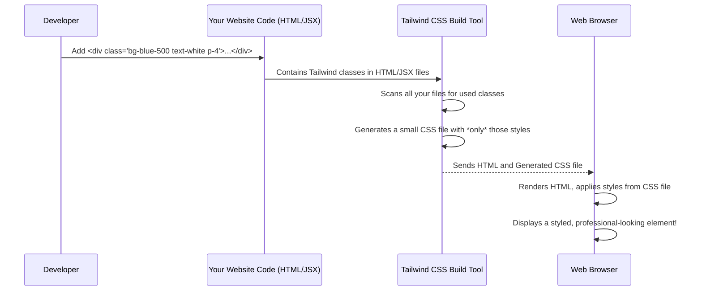

# Chapter 2: Tailwind CSS (Utility-First Styling)

In the previous chapter, we talked about [Frontend UI Components (Shadcn/UI Library)](01_frontend_ui_components__shadcn_ui_library__.md) as our "LEGO bricks" – pre-built, functional pieces like buttons and input fields. But imagine building a LEGO ship without any colors or special details! It would work, but it wouldn't look very exciting.

That's where **Tailwind CSS** comes in. If Shadcn/UI gives us the *structure* (the LEGO bricks), Tailwind CSS gives us the *style* (the paint, stickers, and decorative pieces). It's the secret sauce that makes our Shadcn/UI components look so good and consistent, and it also lets us style *any* other part of our `heritage-shipping-ltd` website with ease.

### What Problem Does Tailwind CSS Solve?

Traditionally, when you want to style something on a webpage, you write custom CSS code in separate files. For example, to make a button blue with white text and some padding, you might write:

```css
/* my-styles.css */
.my-custom-button {
  background-color: blue;
  color: white;
  padding: 16px;
  border-radius: 8px;
}
```

Then, in your HTML, you'd link this CSS file and apply the class:
```html
<button class="my-custom-button">Click Me</button>
```

While this works, imagine doing this for *every single* button, input field, and text block on a large website. You'd end up with:
1.  **Many custom CSS classes:** Hard to remember and manage.
2.  **Inconsistent designs:** It's easy for "my-custom-button" to look slightly different from "another-button" unless you're super careful.
3.  **Large CSS files:** Many classes might only be used once or twice, making your stylesheet bigger than it needs to be, which slows down your website.

Tailwind CSS offers a different, more efficient way: **Utility-First Styling**.

### Tailwind CSS: Your Styling Toolbox

Think of Tailwind CSS as a gigantic toolbox filled with tiny, single-purpose styling tools. Each tool does one specific job, and it does it perfectly. Instead of inventing new names for styles (like `my-custom-button`), you directly use these pre-made "tools" as classes in your HTML.

Here are some examples of these "tools" (called **utility classes**):

| Tailwind Class | What it Does                          | Analogy                                   |
| :------------- | :------------------------------------ | :---------------------------------------- |
| `text-xl`      | Makes text extra-large (font size)    | A "Large Font" sticker                    |
| `bg-blue-500`  | Sets background color to a shade of blue | A "Blue Background" paint swatch          |
| `p-4`          | Adds padding all around (4 units)     | A "Space Around" block                    |
| `rounded-lg`   | Makes corners large and rounded       | A "Rounded Corners" template              |
| `flex`         | Arranges items in a row or column     | A "Flexible Layout" ruler                 |
| `text-white`   | Sets text color to white              | A "White Text" pen                        |

The magic is that you combine these small tools directly in your HTML `class` attribute.

### How to Use Tailwind CSS (Our First Example)

Let's take a simple piece of text and make it look like a prominent heading for our shipping service.

**Traditional CSS approach (what we want to avoid):**
```html
<p class="shipping-header">Welcome to Heritage Shipping</p>
```
```css
/* In a separate CSS file */
.shipping-header {
  font-size: 3rem; /* Very large text */
  font-weight: bold;
  color: navy;
  padding: 24px;
  background-color: lightgray;
  text-align: center;
}
```

**Tailwind CSS approach (how we do it):**
Instead of writing new CSS rules, we directly apply Tailwind's utility classes to the HTML element.

```html
<h1 class="text-5xl font-bold text-primary bg-secondary p-6 text-center rounded-xl">
  Welcome to Heritage Shipping
</h1>
```

**Explanation of the Tailwind classes:**
*   `text-5xl`: Makes the text very, very large (equivalent to `font-size: 3rem;`).
*   `font-bold`: Makes the text bold.
*   `text-primary`: Sets the text color to our website's main primary color (a navy blue in `heritage-shipping-ltd`).
*   `bg-secondary`: Sets the background color to our secondary color (a light gray/off-white).
*   `p-6`: Adds padding of 24 pixels (or similar units) around the text.
*   `text-center`: Centers the text horizontally.
*   `rounded-xl`: Gives the element extra-large rounded corners.

Notice how we didn't write *any* new CSS code. We just assembled the "styling tools" directly in our HTML. This is incredibly fast and keeps your styles consistent because you're always using the same predefined tools.

### Tailwind CSS with Shadcn/UI Components

Remember the `Input` and `Button` components from [Chapter 1: Frontend UI Components (Shadcn/UI Library)](01_frontend_ui_components__shadcn_ui_library__.md)? They are built using Tailwind CSS internally!

For example, when you use `<Input />`, it comes with default Tailwind classes already applied to make it look like a clean input field:

```jsx
// components/ui/input.tsx (simplified)
import { cn } from "@/lib/utils"; // We'll talk about 'cn' soon!

const Input = React.forwardRef<HTMLInputElement, React.ComponentProps<"input">>(
  ({ className, type, ...props }, ref) => {
    return (
      <input
        type={type}
        // These are Tailwind classes defining default input styles!
        className={cn(
          "flex h-10 w-full rounded-md border border-input bg-background px-3 py-2 text-sm ring-offset-background file:border-0 file:bg-transparent file:text-sm file:font-medium placeholder:text-muted-foreground focus-visible:outline-none focus-visible:ring-2 focus-visible:ring-ring focus-visible:ring-offset-2 disabled:cursor-not-allowed disabled:opacity-50",
          className // This lets you add *your own* Tailwind classes too!
        )}
        ref={ref}
        {...props}
      />
    );
  }
);
// ...
export { Input };
```
**Explanation:**
This snippet shows that our `Input` component internally uses a long string of Tailwind classes like `h-10` (height 10 units), `w-full` (full width), `rounded-md` (medium rounded corners), `border` (adds a border), `bg-background` (sets background to our theme's background color), and many more. These classes give the input its default professional appearance.

The `className` prop allows you to *add more* Tailwind classes to override or extend the default styles if needed, giving you full control!

### How Tailwind CSS Works Under the Hood

You might wonder, if you just add classes to HTML, how does the browser know what `text-5xl` means?

Here's the simplified process:



**What's Happening Step-by-Step:**

1.  **You write HTML/JSX with Tailwind classes:** You sprinkle classes like `bg-blue-500` or `p-4` directly onto your HTML elements.
2.  **Tailwind CSS Build Tool Scans Your Code:** When you're ready to deploy your website (or even as you develop it), a special tool (part of the Tailwind CSS setup) scans *all* your project files (`.html`, `.jsx`, `.tsx`, etc.) to find every single Tailwind class you've used.
3.  **It Generates Minimal CSS:** Instead of shipping the entire gigantic Tailwind CSS library (which has thousands of possible classes), the build tool generates a *tiny, optimized* CSS file. This file contains only the exact CSS rules for the specific `bg-blue-500`, `p-4`, `text-xl`, etc., classes that you actually used in your project. This is called **"purging"** or **"tree-shaking"** unused CSS.
4.  **Browser Receives Small CSS:** Your web browser then loads your website's HTML along with this tiny, custom-generated CSS file.
5.  **Your elements look fantastic!** The browser applies the styles from the small CSS file, and your elements are displayed exactly as you intended.

This process ensures that your website loads super fast because it's not downloading a lot of unnecessary styling code.

### Diving Deeper into Tailwind's Configuration

The `heritage-shipping-ltd` project uses a few files to configure how Tailwind CSS works:

1.  **`tailwind.config.ts` (Tailwind Configuration):**
    This file is like the "master plan" for your Tailwind CSS setup. It tells Tailwind about your custom colors, font sizes, spacing, and more. This is where `heritage-shipping-ltd` defines its specific brand colors like `primary` (our navy blue) and `accent` (our red).

    ```typescript
    // tailwind.config.ts (simplified snippet)
    const config: Config = {
        // ...
        theme: {
            extend: {
                colors: {
                    background: 'hsl(var(--background))',
                    foreground: 'hsl(var(--foreground))',
                    primary: {
                        DEFAULT: 'hsl(var(--primary))', // This uses a CSS variable!
                        foreground: 'hsl(var(--primary-foreground))'
                    },
                    secondary: {
                        DEFAULT: 'hsl(var(--secondary))',
                        foreground: 'hsl(var(--secondary-foreground))'
                    },
                    accent: {
                        DEFAULT: 'hsl(var(--accent))',
                        foreground: 'hsl(var(--accent-foreground))'
                    },
                    // ... many more custom colors for our brand
                },
                borderRadius: {
                    lg: 'var(--radius)', // Uses a CSS variable for rounded corners
                    // ...
                },
                // ... animations, keyframes etc.
            }
        },
        // ...
    };
    export default config;
    ```
    **Explanation:**
    *   `colors`: This section is crucial. It defines custom color names like `primary`, `secondary`, and `accent`. When you use `bg-primary` or `text-accent` in your HTML, Tailwind knows to use the specific color defined here. Notice `hsl(var(--primary))` – this means our Tailwind colors are linked to CSS variables, allowing for easy theming (like dark mode!).
    *   `borderRadius`: Similarly, this defines custom sizes for rounded corners, linked to a `--radius` CSS variable.

2.  **`app/globals.css` (Base CSS and Custom Components):**
    This file is where we import Tailwind's core styles and add any project-specific global CSS or custom components that aren't quite "utility-first" but still important.

    ```css
    /* app/globals.css (simplified snippet) */
    @tailwind base;
    @tailwind components;
    @tailwind utilities;

    @layer base {
      :root {
        --background: 0 0% 100%; /* White background for light mode */
        --primary: 220 8% 20.5%; /* HSL Navy Blue */
        --accent: 15 20% 65%; /* HSL Red accent from logo */
        --radius: 0.5rem; /* Default border radius */
        /* ... more CSS variables for different colors */
      }

      .dark {
        --background: 220 5% 14.5%; /* Dark background for dark mode */
        /* ... dark mode CSS variables */
      }

      body {
        @apply bg-background text-foreground font-sans; /* Apply Tailwind to base body */
      }

      h1, h2, h3 {
        @apply font-serif; /* Use our custom serif font for headings */
      }
    }

    @layer components {
      .gradient-text {
        background: linear-gradient(135deg, hsl(var(--primary)), hsl(var(--accent)));
        -webkit-background-clip: text;
        -webkit-text-fill-color: transparent;
        background-clip: text;
      }

      .btn-accent {
        @apply bg-accent text-accent-foreground font-semibold transition-all duration-300 border-2 border-transparent;
      }
      /* ... more custom components/styles that combine multiple Tailwind classes */
    }

    @layer utilities {
      /* Custom keyframe animations not provided by default Tailwind */
      @keyframes fadeIn { /* ... */ }
      /* ... */
    }
    ```
    **Explanation:**
    *   `@tailwind base; @tailwind components; @tailwind utilities;`: These lines are crucial. They tell Tailwind to inject its foundational styles (like resetting browser defaults), any extracted component classes, and all its utility classes into our final CSS file.
    *   `@layer base`: This is where we define global CSS variables (like `--primary` and `--radius`) that are used in `tailwind.config.ts`. It also applies some basic Tailwind styles to HTML elements like `body` and headings.
    *   `@layer components`: Sometimes, even with utility-first, you might find yourself repeating the same group of Tailwind classes (e.g., for a special button variant). Here, you can create a custom class (like `gradient-text` or `btn-accent`) and use `@apply` to include multiple Tailwind utility classes within it. This is useful for project-specific reusable styles.
    *   `@layer utilities`: This layer allows you to add your *own* utility classes or custom animations that aren't directly part of Tailwind's default set, ensuring they are processed correctly.

3.  **`lib/utils.ts` (`cn` helper):**
    You might have noticed `cn` being used in the Shadcn/UI component examples from [Chapter 1: Frontend UI Components (Shadcn/UI Library)](01_frontend_ui_components__shadcn_ui_library__.md). This is a tiny but powerful helper function that makes working with Tailwind classes in React much easier.

    ```typescript
    // lib/utils.ts
    import { clsx, type ClassValue } from "clsx"
    import { twMerge } from "tailwind-merge"

    export function cn(...inputs: ClassValue[]) {
      return twMerge(clsx(inputs))
    }
    ```
    **Explanation:**
    The `cn` function combines two super useful libraries:
    *   **`clsx`**: This helps you conditionally join class names together. For example, you might want to add `bg-red-500` only if an error occurs.
        ```javascript
        // Example with clsx
        let isActive = true;
        let classes = clsx('base-style', isActive && 'active-style');
        // classes will be "base-style active-style"
        ```
    *   **`twMerge`**: This is specifically for Tailwind CSS. If you accidentally provide conflicting Tailwind classes (like `p-4` and `p-8`), `twMerge` intelligently resolves them, making sure the *last* or most specific class wins. It prevents unexpected styling issues.
        ```javascript
        // Example with twMerge
        import { twMerge } from 'tailwind-merge';
        let classes = twMerge('bg-red-500 p-4', 'bg-blue-500 p-8');
        // classes will be "bg-blue-500 p-8" (blue and p-8 override red and p-4)
        ```
    By combining these two, `cn` is perfect for building dynamic and robust class strings for our React components, ensuring that Shadcn/UI components can easily accept additional styling from us without conflicts.

### Conclusion

You've now got a good grasp of Tailwind CSS and why it's a game-changer for building fast, consistent, and beautiful user interfaces. It moves styling directly into your HTML, using small, single-purpose "utility classes" like `bg-primary` or `p-4`. This approach, combined with a smart build process that only includes the CSS you actually use, results in incredibly efficient and maintainable stylesheets for our `heritage-shipping-ltd` project.

In the next chapter, we'll explore [Client-side Utility Hooks (Reusable UI Logic)](03_client_side_utility_hooks__reusable_ui_logic__.md). These are small, reusable pieces of code that help manage the interactive parts of our website, much like `cn` helped manage our styling classes!

---
<sub><sup>**References**: [[1]](https://github.com/duttaturja-v2/heritage-shipping-ltd/blob/5b1bb363c463a5caff32e3a29cedf7676dfb34e4/app/globals.css), [[2]](https://github.com/duttaturja-v2/heritage-shipping-ltd/blob/5b1bb363c463a5caff32e3a29cedf7676dfb34e4/components.json), [[3]](https://github.com/duttaturja-v2/heritage-shipping-ltd/blob/5b1bb363c463a5caff32e3a29cedf7676dfb34e4/lib/utils.ts), [[4]](https://github.com/duttaturja-v2/heritage-shipping-ltd/blob/5b1bb363c463a5caff32e3a29cedf7676dfb34e4/tailwind.config.ts)</sup></sub>