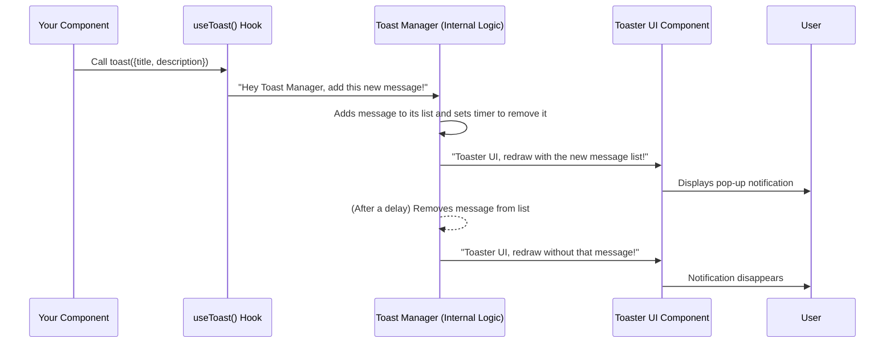
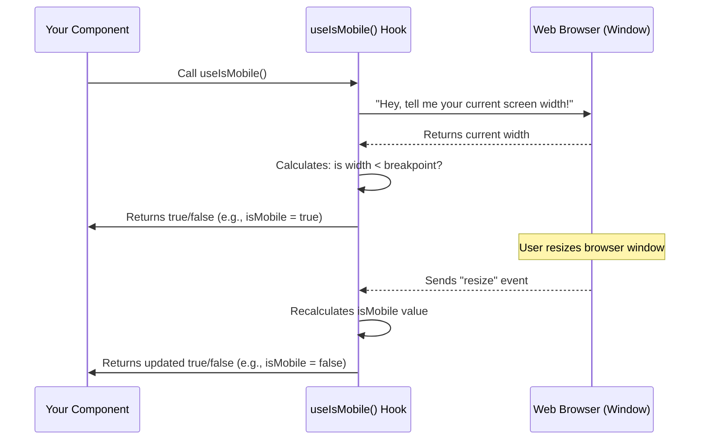

# Chapter 3: Client-side Utility Hooks (Reusable UI Logic)

In the previous chapters, we learned how [Frontend UI Components (Shadcn/UI Library)](01_frontend_ui_components__shadcn_ui_library__.md) provide us with pre-built "LEGO bricks" for our website's interface, and how [Tailwind CSS (Utility-First Styling)](02_tailwind_css__utility_first_styling__.md) acts as our "paint and decoration kit" to make those bricks look fantastic. We now have beautiful, consistent UI elements.

But what about the *logic* behind the scenes? What if we want a little message to pop up when a user submits a form, or what if our website needs to change its layout when someone visits from a mobile phone versus a desktop computer? We need reusable ways to handle these common interactions without writing the same code over and over again.

This is where **Client-side Utility Hooks** come in. They are like special, pre-made "gadgets" that you can plug into your React components to add powerful, reusable behaviors.

### What Problem Do Utility Hooks Solve?

Imagine you're building a ship. You have a great set of tools for building the hull and painting it. But you also need tools for navigation, communication, and emergency alerts. These aren't just parts of the ship; they're *systems* that provide specific functionalities.

In our `heritage-shipping-ltd` website, we often encounter situations where similar logic is needed across different parts of the application:
*   **Showing Notifications:** Every time a user successfully performs an action (e.g., "Order placed!", "Login successful!"), we want to show a small, temporary message.
*   **Adapting to Screen Size:** We want our layout to look great on both large desktop screens and small mobile phones. This means our components need to know the current screen size.
*   **Managing Complex State:** Maybe a component needs to keep track of a loading status, an error message, or data fetched from the server.

If we wrote the code for these features directly inside every single component that needs them, our code would become:
1.  **Repetitive:** Lots of copy-pasting of the same logic.
2.  **Hard to maintain:** If you find a bug in one notification system, you have to fix it everywhere.
3.  **Cluttered:** Our simple UI components would be filled with complex logic, making them harder to read and understand.

Utility hooks solve this by extracting common UI logic into reusable functions, making our components cleaner and our development faster.

### What is a "Hook" in React?

Before we talk about *utility* hooks, let's briefly understand what a "hook" is in React. In React, a component is like a small, independent part of our UI (e.g., a button, a form). Traditionally, if you wanted a component to remember information (like text typed into an input field) or do something after it appears on the screen, you used special "class components."

But React introduced "hooks" to let you "hook into" these React features (like remembering information, called "state," or performing actions, called "lifecycle methods") directly from simpler "functional components." Think of them as special built-in gadgets provided by React:
*   `useState`: A gadget for a component to remember its own data.
*   `useEffect`: A gadget for a component to do something after it renders or when certain things change (like fetching data).

### What is a "Utility Hook" (Custom Hook)?

A **utility hook** (also known as a **custom hook**) is simply a special JavaScript function that *uses* other React hooks (`useState`, `useEffect`, etc.) and packages up some reusable logic. The main rule for a custom hook is that its name *must* start with `use` (e.g., `useToast`, `useIsMobile`). This tells React it's a hook and ensures it follows certain rules.

Think of it this way: If `useState` and `useEffect` are basic tools like a screwdriver and a wrench, a utility hook is like a specialized multi-tool you've custom-built from those basic tools. You might combine a screwdriver, a light, and a timer to make a "Smart Lighting Controller" tool.

### Why Use Reusable UI Logic (Utility Hooks)?

The benefits are clear:

*   **Reduces Duplication:** Write the logic once, use it everywhere.
*   **Improves Readability:** Your components stay focused on what they display, not how complex background logic works.
*   **Easier Testing:** You can test the hook's logic independently of the components that use it.
*   **Consistent Behavior:** All parts of your app using the same hook will behave consistently.

### How `heritage-shipping-ltd` Uses Utility Hooks

Let's look at two key utility hooks used in our project: `useToast` for notifications and `useIsMobile` for screen size detection.

#### Use Case 1: Showing Temporary Notifications with `useToast`

We often need to show a brief message, like "Your inquiry has been sent!" or "User data updated." Our project uses `useToast` to make this incredibly easy.

**How to use it in your component:**

First, you "hook into" the `useToast` gadget in your component. This gives you a `toast` function that you can call to show messages.

```jsx
// Imagine this is part of a form submission component
import { Button } from "@/components/ui/button";
import { useToast } from "@/hooks/use-toast"; // Our special gadget!

function MyForm() {
  const { toast } = useToast(); // Hook into the toast gadget!

  const handleSubmit = () => {
    // ... imagine sending data to the server here ...

    // Now, show a success message!
    toast({
      title: "Success!",
      description: "Your inquiry was sent.",
      variant: "default", // You can customize its appearance
    });
  };

  return (
    <Button onClick={handleSubmit}>Send Inquiry</Button>
  );
}

export default MyForm;
```
**Explanation:**
*   `import { useToast } from "@/hooks/use-toast";`: This line brings our `useToast` utility hook into our component file. Notice it's located in the `hooks` folder.
*   `const { toast } = useToast();`: This is how you "activate" the `useToast` gadget within your component. It gives you back a `toast` function.
*   `toast({...});`: This is the magic! When `handleSubmit` is called (e.g., when the user clicks the "Send Inquiry" button), we call the `toast` function with some options like `title`, `description`, and `variant`.

**What happens:** When `handleSubmit` is triggered, a small, nicely styled notification (often called a "toast" message) will pop up on the screen, usually in a corner, and then fade away after a short time.

#### Use Case 2: Detecting Mobile Devices with `useIsMobile`

Our website needs to look good on all devices. Sometimes, this means showing or hiding certain elements, or even completely changing a component's layout based on whether the user is on a mobile phone or a desktop. `useIsMobile` helps us do this.

**How to use it in your component:**

```jsx
// Imagine this is a component that shows a sidebar
import { useIsMobile } from "@/hooks/use-mobile"; // Our screen detector gadget!

function ResponsiveHeader() {
  const isMobile = useIsMobile(); // Hook into the mobile detector!

  return (
    <header>
      <h1>Heritage Shipping Ltd.</h1>
      {isMobile ? (
        <p>Mobile Menu (Tap to open)</p> // Shown only on mobile
      ) : (
        <p>Desktop Navigation Links</p> // Shown only on desktop
      )}
    </header>
  );
}

export default ResponsiveHeader;
```
**Explanation:**
*   `import { useIsMobile } from "@/hooks/use-mobile";`: This brings our `useIsMobile` utility hook into our component.
*   `const isMobile = useIsMobile();`: This activates the `useIsMobile` gadget. It immediately tells you if the screen is currently mobile-sized or not by returning `true` or `false`.
*   `{isMobile ? (...) : (...)}`: This is a common React pattern that says: "If `isMobile` is true, show the first part; otherwise, show the second part."

**What happens:** If you open the website on a phone, you'll see "Mobile Menu (Tap to open)". If you open it on a large desktop monitor, you'll see "Desktop Navigation Links". And if you resize your desktop browser window to be very small, the text will dynamically change!

### What's Under the Hood? (How do these gadgets work?)

Let's peek inside these utility hooks to understand their magic. They combine basic React hooks like `useState` (to remember values) and `useEffect` (to perform actions and respond to changes) to create their special behavior.

#### The `useToast` Hook (Your Messenger Pigeon Gadget)

When you call `toast()`, a series of steps happen to make that notification appear:



Let's look at the simplified code from `hooks/use-toast.ts`:

```typescript
// hooks/use-toast.ts (Simplified)
"use client" // This hook runs on the user's browser

import * as React from "react"
// Imports for the visual Toast component (from Shadcn/UI)
import type { ToastProps } from "@/components/ui/toast"

// A custom type for our toast messages
type ToasterToast = ToastProps & {
  id: string
  title?: React.ReactNode
  description?: React.ReactNode
}

// This is the core function you call in your components
function useToast() {
  // We use React's built-in `useState` to remember all active toasts.
  // `memoryState` is just a global variable storing current toasts.
  const [state, setState] = React.useState<State>(memoryState)

  // `useEffect` listens for changes in `memoryState` and updates the component.
  React.useEffect(() => {
    // When a component uses useToast, it "subscribes" to changes.
    listeners.push(setState)
    return () => {
      // When the component is removed, it "unsubscribes".
      const index = listeners.indexOf(setState)
      if (index > -1) { listeners.splice(index, 1) }
    }
  }, [state]) // React's dependency array: re-run if 'state' changes

  return {
    ...state,
    // We return a `toast` function that's specifically designed to
    // add new messages to our global toast list.
    toast,
    // Also a dismiss function if you need to manually close a toast.
    dismiss: (toastId?: string) => dispatch({ type: "DISMISS_TOAST", toastId }),
  }
}

// This `toast` function is also exported and directly callable
// It's the one that actually adds a new message to the system.
function toast({ ...props }: Toast) {
  const id = genId() // Generate a unique ID for this message

  // This `dispatch` function is the central brain that updates `memoryState`
  // based on actions like "ADD_TOAST".
  dispatch({
    type: "ADD_TOAST",
    toast: {
      ...props,
      id,
      open: true,
      // When the user clicks to close a toast, this calls dismiss()
      onOpenChange: (open) => { if (!open) dismiss() },
    },
  })

  // Return an object to manage this specific toast (e.g., update or dismiss it later)
  return { id: id, dismiss }
}

export { useToast, toast }
```
**Explanation:**
*   **`useToast()`:** This is the *hook* part. It uses `useState` and `useEffect` to subscribe to a global list of toast messages. When that list changes (because `toast()` was called), `useToast` ensures your component knows about it and re-renders if needed.
*   **`toast()`:** This is the *function* you call to trigger a new toast message. It generates a unique ID, then tells a central "dispatch" system (similar to a control center) to "ADD_TOAST" with all the message details.
*   **`dispatch` and `reducer` (the "brain"):** Not fully shown here for simplicity (it's a bit longer), but there's a system (the `reducer` function and `dispatch` function) that acts as the "brain" for all toasts. It manages a single, global list of toast messages, adding new ones, removing old ones (after their timer runs out), and updating existing ones.
*   **`Toaster` Component:** This is a separate React component (`components/ui/toaster.tsx`) that *uses* `useToast` itself! It constantly watches the list of active toasts provided by `useToast` and then renders the actual visual pop-up messages using Shadcn/UI's `Toast` components.

This separation means your components don't need to know *how* toasts are managed or displayed; they just call `toast()`, and the `useToast` hook handles the rest, connecting it to the `Toaster` UI.

#### The `useIsMobile` Hook (Your Screen Size Detector Gadget)

Here's how `useIsMobile` works its magic by detecting your screen size:



Now, let's look at the simplified code from `hooks/use-mobile.tsx`:

```typescript
// hooks/use-mobile.tsx (Simplified)
import * as React from "react"

const MOBILE_BREAKPOINT = 768 // Our definition of "mobile" (pixels)

export function useIsMobile() {
  // 1. We use `useState` to remember if the device is mobile.
  // It starts as `undefined` because we don't know initially.
  const [isMobile, setIsMobile] = React.useState<boolean | undefined>(undefined)

  // 2. `useEffect` is used to run code after the component renders
  // and to clean up when the component is removed.
  React.useEffect(() => {
    // `window.matchMedia` is a browser feature to check media queries (like screen width).
    const mql = window.matchMedia(`(max-width: ${MOBILE_BREAKPOINT - 1}px)`)

    // This function will be called when the screen size changes.
    const onChange = () => {
      setIsMobile(window.innerWidth < MOBILE_BREAKPOINT)
    }

    // We tell the browser to call `onChange` whenever the media query matches/unmatches.
    mql.addEventListener("change", onChange)

    // And we set the initial state immediately when the component first loads.
    setIsMobile(window.innerWidth < MOBILE_BREAKPOINT)

    // This is the cleanup function: stop listening for changes when component unmounts.
    return () => mql.removeEventListener("change", onChange)
  }, []) // Empty array means this effect runs once after the initial render.

  // The hook returns `true` or `false` (converting `undefined` to `false` if it somehow occurs).
  return !!isMobile
}
```
**Explanation:**
*   **`useState`:** This part sets up a variable, `isMobile`, which will hold `true` if the screen is mobile-sized, or `false` otherwise. It starts as `undefined` because the hook needs a moment to figure out the screen size.
*   **`useEffect`:** This is the core logic.
    *   It uses `window.matchMedia` to check if the browser's width is less than our `MOBILE_BREAKPOINT` (768 pixels).
    *   It also sets up an "event listener": a little observer that waits for the browser window to change size.
    *   Whenever the window resizes, the `onChange` function is called, and it updates our `isMobile` state.
    *   The `return` part in `useEffect` is crucial: it cleans up the event listener when the component that uses `useIsMobile` is no longer on the screen, preventing memory leaks.
*   **`return !!isMobile`:** Finally, the hook returns the current `isMobile` status.

This hook is incredibly useful for building responsive layouts, and it's used internally by components like `components/ui/sidebar.tsx` to ensure it behaves correctly on different screen sizes (e.g., showing a sheet sidebar on mobile vs. a fixed sidebar on desktop).

### Conclusion

You've now explored Client-side Utility Hooks, powerful reusable "gadgets" that encapsulate common UI logic. We saw how `useToast` makes showing notifications a breeze and how `useIsMobile` allows our `heritage-shipping-ltd` website to adapt its layout to different screen sizes. By abstracting these behaviors into hooks, we keep our components clean, reduce code duplication, and ensure consistent, robust interactions across our frontend.

With a solid understanding of our frontend UI components, styling, and reusable logic, we're ready to shift our focus to the backend. In the next chapter, we'll dive into [Django Models (Data Blueprints)](04_django_models__data_blueprints__.md), learning how we define the structure of the data our shipping company will manage, such as shipments, customers, and more.

---
<sub><sup>**References**: [[1]](https://github.com/duttaturja-v2/heritage-shipping-ltd/blob/5b1bb363c463a5caff32e3a29cedf7676dfb34e4/components/ui/sidebar.tsx), [[2]](https://github.com/duttaturja-v2/heritage-shipping-ltd/blob/5b1bb363c463a5caff32e3a29cedf7676dfb34e4/components/ui/toaster.tsx), [[3]](https://github.com/duttaturja-v2/heritage-shipping-ltd/blob/5b1bb363c463a5caff32e3a29cedf7676dfb34e4/hooks/use-mobile.tsx), [[4]](https://github.com/duttaturja-v2/heritage-shipping-ltd/blob/5b1bb363c463a5caff32e3a29cedf7676dfb34e4/hooks/use-toast.ts)</sup></sub>