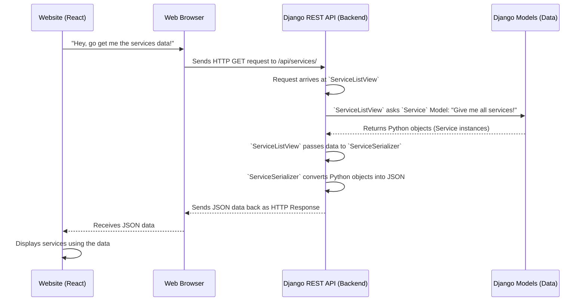

# Chapter 5: Django REST API (Backend Communicator)

In the previous chapter, [Django Models (Data Blueprints)](04_django_models__data_blueprints__.md), we learned how to set up the "filing cabinets" and "catalog cards" for all the important information our `heritage-shipping-ltd` company needs to store. We designed blueprints for `Service` (what we offer), `Shipment` (what we ship), and `User` (our customers). This is great for organizing our data internally within the backend.

But what about the frontend – the beautiful website interface we're building with [Frontend UI Components (Shadcn/UI Library)](01_frontend_ui_components__shadcn_ui_library__.md) and [Tailwind CSS (Utility-First Styling)](02_tailwind_css__utility_first_styling__.md)? How does that friendly user interface actually *talk* to our backend's neatly organized data? How does it ask for "all available services" or tell the backend "hey, a new quote request just came in!"?

This is where the **Django REST API** comes in. Think of it as the **"front desk" or "concierge" of our backend**. It's the designated communication channel where the frontend sends its requests (like asking a question or submitting a form) and receives neatly packaged responses.

### What Problem Does the Django REST API Solve?

Imagine you're at the `heritage-shipping-ltd` headquarters. The people at the front desk (our **Django REST API**) have a very important job:

1.  **Understanding Requests:** They need to understand what customers (the frontend) are asking for, whether it's "Get me a list of all your services!" or "Here's my new contact inquiry, please save it."
2.  **Getting/Processing Information:** They then go to the right department (our [Django Models](04_django_models__data_blueprints__.md) and database) to fetch or store the necessary information.
3.  **Translating Information:** The backend speaks "database language" (Python objects, SQL), but the frontend speaks "web language" (JavaScript, JSON). The front desk needs to translate the information from database format into a format the frontend can easily understand (JSON) before sending it back.
4.  **Sending Responses:** They send back a clear, structured answer to the customer (the frontend).

Without this "front desk," our beautiful frontend would be like a mute display, unable to interact with any real company data. The API is the bridge that allows our web application to fetch and send information dynamically.

### Core Concepts of the Django REST API

We use a powerful tool called **Django REST Framework (DRF)** to build our API. DRF makes it much easier to create these "front desk" services. Let's break down its key concepts:

#### 1. What is an API? (Application Programming Interface)

An API is simply a set of rules and tools that lets different computer programs talk to each other. It defines how one piece of software can request services from another.

#### 2. What is REST? (Representational State Transfer)

REST is a popular *style* or *architecture* for designing APIs, especially for web services. It uses standard web concepts like:
*   **URLs (Uniform Resource Locators):** Specific addresses for different "resources" (like `/services/` for services, `/shipments/` for shipments).
*   **HTTP Methods:** Standard actions like:
    *   **GET:** To *get* information (e.g., "GET me all services").
    *   **POST:** To *create* new information (e.g., "POST a new contact inquiry").
    *   **PUT/PATCH:** To *update* existing information.
    *   **DELETE:** To *remove* information.

#### 3. Django REST Framework (DRF)

DRF is a toolkit on top of Django that helps us quickly build powerful and flexible REST APIs. It provides ready-made components that handle much of the complexity, so we can focus on our business logic.

#### 4. Views (DRF Views): The "Procedures" at the Front Desk

In the context of DRF, **Views** are Python classes or functions that define *what happens* when the API receives a specific type of request at a particular URL. Each View is like a specific "procedure" or "transaction type" offered at the front desk.

For example:
*   A `ServiceListView` would define the procedure for "listing all services."
*   A `ContactCreateView` would define the procedure for "receiving and saving a new contact inquiry."

DRF provides generic views (like `ListAPIView`, `CreateAPIView`) that handle common tasks (listing, creating, updating) with minimal code.

#### 5. Serializers: The "Translators" and "Formatters"

**Serializers** are perhaps the most crucial part of the API's "front desk" analogy. They are like specialist translators who handle the conversation between Django (Python objects, database language) and the frontend (JSON, web language).

*   **From Backend to Frontend:** A Serializer takes data from a [Django Model](04_django_models__data_blueprints__.md) (which is a Python object) and translates it into **JSON (JavaScript Object Notation)**, a lightweight text format that web browsers and JavaScript understand easily.
*   **From Frontend to Backend:** Conversely, if the frontend sends JSON data (e.g., a new contact inquiry), the Serializer can take that JSON, validate it, and convert it into a Python object that can then be saved to our [Django Models](04_django_models__data_blueprints__.md) in the database.

Think of it like converting a detailed internal company report into a concise, easy-to-read summary for an external client.

#### 6. URLs: The "Direct Phone Lines" to the Front Desk Procedures

Just like you dial a specific extension to reach a particular department or service, **URLs** define the "endpoints" or "routes" where the frontend can send its requests.

For example:
*   `api/services/` might be the URL to get all services.
*   `api/contact/` might be the URL to submit a contact inquiry.

These URLs are mapped to specific DRF Views in our Django project's `urls.py` file.

### How to Use the Django REST API (Our Services List Example)

Let's trace our use case: the frontend wants to display a list of all shipping services offered by `heritage-shipping-ltd`.

Here's the simplified flow of how the API handles this request:



Let's look at the simplified code snippets that make this happen in our `heritage-shipping-ltd` project.

#### 1. Defining the `ServiceSerializer` (`backend/shipping/serializers.py`)

This serializer tells DRF how to convert our `Service` [Django Model](04_django_models__data_blueprints__.md) objects into JSON and vice-versa.

```python
# backend/shipping/serializers.py (simplified)
from rest_framework import serializers
from .models import Service # Import our Service blueprint!

class ServiceSerializer(serializers.ModelSerializer):
    class Meta:
        model = Service # This serializer is for the Service model
        fields = '__all__' # Include all fields from the Service model
```
**Explanation:**
*   `class ServiceSerializer(serializers.ModelSerializer)`: We create a class that inherits from `ModelSerializer`. This is a special DRF serializer that automatically figures out how to convert a [Django Model](04_django_models__data_blueprints__.md) into JSON.
*   `model = Service`: We tell the serializer *which* [Django Model](04_django_models__data_models__.md) it's responsible for.
*   `fields = '__all__'` This is a shortcut meaning "include all the fields defined in the `Service` model." So, if our `Service` model has `name`, `description`, `icon`, and `features`, the JSON output will include all of these.

**Example JSON Output from `ServiceSerializer`:**

If you have a `Service` in your database with `name="Sea Freight"` and `description="Ocean cargo shipping"`, the serializer would convert it into JSON like this:

```json
{
    "id": 1,
    "name": "Sea Freight",
    "description": "Ocean cargo shipping with global reach.",
    "features": ["Full Container Load", "Less Than Container Load"],
    "icon": "ocean",
    "created_at": "2024-07-20T10:00:00Z"
}
```
This JSON format is universally understood by web applications.

#### 2. Defining the `ServiceListView` (`backend/shipping/views.py`)

This View handles the incoming GET request for services and uses the serializer to prepare the response.

```python
# backend/shipping/views.py (simplified)
from rest_framework import generics # Import generic views
from .models import Service # Import our Service blueprint
from .serializers import ServiceSerializer # Import our Service translator

class ServiceListView(generics.ListAPIView):
    queryset = Service.objects.all() # What data should this view work with? All Services!
    serializer_class = ServiceSerializer # Which translator should it use? The ServiceSerializer!
```
**Explanation:**
*   `class ServiceListView(generics.ListAPIView)`: We use DRF's `ListAPIView`. This is a powerful "generic" view that knows *how to list a collection of objects* without us writing much code. It handles the GET request, fetches data, serializes it, and sends it back.
*   `queryset = Service.objects.all()`: This tells the `ListAPIView` *which* [Django Model](04_django_models__data_blueprints__.md) objects it should fetch from the database. `Service.objects.all()` means "get all records from the `Service` model."
*   `serializer_class = ServiceSerializer`: This tells the `ListAPIView` *which serializer* to use to translate the fetched `Service` objects into JSON for the response.

#### 3. Mapping the URL (`backend/shipping/urls.py`)

Finally, we need to tell Django which URL path should trigger our `ServiceListView`.

```python
# backend/shipping/urls.py (simplified)
from django.urls import path
from . import views # Import our views from the current directory

urlpatterns = [
    # When a GET request comes to '/api/services/', use ServiceListView
    path('services/', views.ServiceListView.as_view(), name='service-list'),
    # ... other paths for other API endpoints
]
```
**Explanation:**
*   `path('services/', ...)`: This defines that any request to `/api/services/` (because this `urls.py` is included under `api/` in `heritage_shipping/urls.py`) will be handled here.
*   `views.ServiceListView.as_view()`: We tell Django to use our `ServiceListView` for this URL. `.as_view()` is necessary because `ServiceListView` is a class, and Django needs to turn it into a function that can handle web requests.
*   `name='service-list'`: This gives a convenient name to this URL pattern, useful for referring to it elsewhere in Django.

### Under the Hood: The Request Flow

Let's summarize the journey of a request asking for services:

1.  **Frontend Request:** Your React frontend (perhaps a page showing "Our Services") sends an HTTP `GET` request to `http://your-website.com/api/services/`.
2.  **Django URL Routing:** Django receives this request. It looks at its main URL patterns (`heritage_shipping/urls.py`) and sees that anything starting with `api/` should be handled by `shipping.urls`. It then looks inside `shipping/urls.py` and finds the `path('services/', ...)` which matches.
3.  **View Invocation:** The `path` directs the request to our `ServiceListView`.
4.  **Data Fetching:** Inside `ServiceListView`, because it's a `ListAPIView`, it automatically knows to use `Service.objects.all()` to query the database. It retrieves all `Service` records as Python objects.
5.  **Serialization:** The `ServiceListView` then takes these Python `Service` objects and passes them to the `ServiceSerializer` (which was specified by `serializer_class`). The `ServiceSerializer` translates each Python object into a dictionary and then converts the entire list into a JSON array.
6.  **Response:** The `ServiceListView` wraps this JSON data into an HTTP response and sends it back to the frontend.
7.  **Frontend Display:** The frontend receives the JSON, parses it, and uses the data to display a beautiful list of services to the user.

This pattern (URL -> View -> Serializer -> Model) is fundamental to how Django REST Framework works, and you'll see it repeated for almost every piece of data our application interacts with.

The `backend/shipping/views.py`, `backend/shipping/serializers.py`, and `backend/shipping/urls.py` files are filled with similar patterns for other resources like `Vessel`s, `NewsArticle`s, `JobPosting`s, and `Shipment` tracking. For instance:

*   **`JobPostingSerializer`** and **`JobListView`**: To get a list of available job postings.
*   **`ContactInquirySerializer`** and **`ContactCreateView`**: To allow the frontend to send new contact inquiries (using a `POST` request).
*   **`ShipmentSerializer`** and the `track_shipment` function-based view: To get details about a specific shipment by its tracking number. Notice `track_shipment` also uses `permission_classes=[permissions.IsAuthenticated]` to ensure only logged-in users can track their shipments – a topic for our next chapter!

### Conclusion

You've now learned about the **Django REST API**, the crucial "backend communicator" for `heritage-shipping-ltd`. This API, built using Django REST Framework, acts as the "front desk," handling requests from our frontend, fetching and translating data using **Serializers**, and responding in a clear, standardized JSON format. This powerful bridge connects our structured [Django Models (Data Blueprints)](04_django_models__data_blueprints__.md) to our interactive frontend, allowing our web application to manage and display all the critical shipping information.

Speaking of managing information, not everyone should be able to access all data. In the next chapter, we'll explore the [Authentication System (User Identity & Access)](06_authentication_system__user_identity___access__.md), which ensures that only authorized users can access specific parts of our API and their sensitive data.

---

 <sub><sup>**References**: [[1]](https://github.com/duttaturja-v2/heritage-shipping-ltd/blob/5b1bb363c463a5caff32e3a29cedf7676dfb34e4/backend/heritage_shipping/urls.py), [[2]](https://github.com/duttaturja-v2/heritage-shipping-ltd/blob/5b1bb363c463a5caff32e3a29cedf7676dfb34e4/backend/shipping/serializers.py), [[3]](https://github.com/duttaturja-v2/heritage-shipping-ltd/blob/5b1bb363c463a5caff32e3a29cedf7676dfb34e4/backend/shipping/urls.py), [[4]](https://github.com/duttaturja-v2/heritage-shipping-ltd/blob/5b1bb363c463a5caff32e3a29cedf7676dfb34e4/backend/shipping/views.py)</sup></sub>