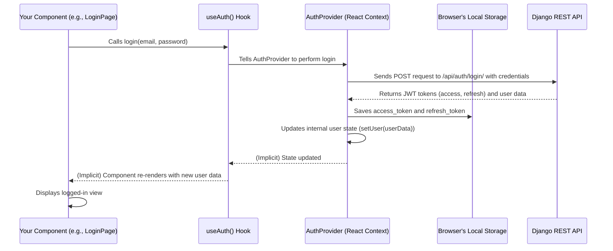

# Chapter 6: Authentication System (User Identity & Access)

In the previous chapter, [Django REST API (Backend Communicator)](05_django_rest_api__backend_communicator__.md), we learned how our frontend and backend can talk to each other to fetch and send data about services, shipments, and more. This "front desk" for our data is fantastic, but what if we need to control *who* can access certain information or perform specific actions? For instance, only a logged-in customer should be able to see *their* shipments, not everyone else's.

This is where the **Authentication System** comes into play. Think of it as the **security guard at the entrance of our Heritage Shipping Ltd. headquarters**. This guard's job is to:

1.  **Verify Identity:** Make sure you are who you say you are (e.g., "Are you John Doe, a registered customer?").
2.  **Check Access Rights:** Determine what parts of the building you're allowed to enter and what actions you can take (e.g., "Yes, you can check *your* shipment status, but you can't access confidential company records.").

Our authentication system handles everything from a user signing up for an account, logging in, staying logged in during their visit (maintaining a "session"), and crucially, controlling what data they are permitted to see or modify through our API. It uses **JWT (JSON Web Tokens)** for secure and efficient communication, acting like a digital, tamper-proof ID card for our users.

### What Problem Does the Authentication System Solve?

Without an authentication system, our website would be wide open. Anyone could potentially see sensitive customer data, create shipments under someone else's name, or even post fake news articles. This is clearly not safe or professional!

The authentication system solves these critical problems by ensuring:
*   **Privacy:** Only authorized users can access their personal data (e.g., their address, their shipment history).
*   **Security:** Prevents unauthorized actions like creating, updating, or deleting sensitive information.
*   **Personalization:** Allows the website to show information relevant to the logged-in user (e.g., "Welcome back, John! Here are your latest shipments.").
*   **Account Management:** Provides a way for users to register, log in, and manage their own profiles.

### Core Concepts of Authentication

Let's break down the main ideas behind how our system manages user identity and access:

1.  **User Registration (Sign Up):**
    *   This is the process where a new person creates an account by providing details like their name, email, and a password. Our system stores this as a new [Django User Model](04_django_models__data_blueprints__.md) in the database.

2.  **User Login (Sign In):**
    *   Once registered, users can sign in by providing their email and password. The system verifies these credentials. If correct, it issues them a special "pass" (a JWT) that proves they are logged in.

3.  **User Session:**
    *   After logging in, the user has an active "session." This means they don't need to enter their password every time they click a new page. The system remembers they're logged in using the JWT they received.

4.  **JWT (JSON Web Tokens): The Digital ID Card**
    *   JWTs are compact, self-contained, and digitally signed pieces of information. When you log in, the server gives you a JWT.
    *   Your web browser stores this JWT.
    *   For every subsequent request to our [Django REST API (Backend Communicator)](05_django_rest_api__backend_communicator__.md) that requires a user to be logged in (like checking your shipments), your browser automatically sends this JWT along.
    *   The backend then quickly checks the JWT:
        *   Is it valid? (Has it expired? Is it correctly signed by our server?)
        *   Who does it belong to? (It contains the user's ID).
    *   Based on this, the backend decides whether to grant access to the requested data or action.

5.  **Access Control (Permissions):**
    *   This is where we define *what* a logged-in user is allowed to do. For example:
        *   Any user can view public services.
        *   Only *logged-in* users can view their own shipments.
        *   Only *admin* users can add new news articles.

### How to Use the Authentication System (Frontend)

On the frontend, we have a special "gadget" (a [Client-side Utility Hook](03_client_side_utility_hooks__reusable_ui_logic__.md)) called `useAuth`. This hook makes it super easy for our React components to interact with the authentication system.

The `useAuth` hook is provided by the `AuthProvider` component, which wraps our entire application. It acts as a central brain that keeps track of who is logged in and handles all the messy details of sending requests to the Django backend and managing JWTs.

Here's how our `LoginPage` and `RegisterPage` components use `useAuth`:

#### 1. Registering a New User (`app/register/page.tsx`)

When a user wants to create a new account, they fill out a form. The `RegisterPage` uses `useAuth` to send this data to the backend.

```jsx
// app/register/page.tsx (simplified)
"use client"
import { useState } from "react"
import { useRouter } from "next/navigation"
import { useAuth } from "@/components/auth-provider" // Our Auth gadget!

export default function RegisterPage() {
  const [formData, setFormData] = useState({ /* ... fields like email, password */ })
  const [error, setError] = useState("")
  const { register } = useAuth() // Get the register function from useAuth
  const router = useRouter()

  const handleSubmit = async (e: React.FormEvent) => {
    e.preventDefault()
    setError("")

    if (formData.password !== formData.password_confirm) {
      setError("Passwords do not match")
      return
    }

    try {
      await register(formData) // Call the register function!
      router.push("/profile") // Go to profile page on success
    } catch (err) {
      setError("Registration failed. Please try again.")
    }
  }

  return (
    // ... JSX for the registration form ...
    <form onSubmit={handleSubmit}>
      {/* ... Input fields for email, username, password, etc. */}
      <button type="submit">Create Account</button>
    </form>
  )
}
```
**Explanation:**
*   `useAuth()`: We "hook into" our authentication system, getting access to its `register` function.
*   `await register(formData)`: When the user submits the form, we simply call `register` with all the form data. The `useAuth` hook handles sending this data to the backend's `/api/auth/register/` endpoint.
*   `router.push("/profile")`: If registration is successful, the user is redirected to their profile page. The `useAuth` hook also automatically saves the received JWTs and updates the user's login status!

#### 2. Logging In (`app/login/page.tsx`)

Similarly, for logging in, the `LoginPage` uses the `login` function from `useAuth`.

```jsx
// app/login/page.tsx (simplified)
"use client"
import { useState } from "react"
import { useRouter } from "next/navigation"
import { useAuth } from "@/components/auth-provider" // Our Auth gadget!

export default function LoginPage() {
  const [email, setEmail] = useState("")
  const [password, setPassword] = useState("")
  const [error, setError] = useState("")
  const { login } = useAuth() // Get the login function from useAuth
  const router = useRouter()

  const handleSubmit = async (e: React.FormEvent) => {
    e.preventDefault()
    setError("")
    try {
      await login(email, password) // Call the login function!
      router.push("/profile") // Go to profile page on success
    } catch (err) {
      setError("Invalid email or password")
    }
  }

  return (
    // ... JSX for the login form ...
    <form onSubmit={handleSubmit}>
      <input type="email" value={email} onChange={(e) => setEmail(e.target.value)} />
      <input type="password" value={password} onChange={(e) => setPassword(e.target.value)} />
      <button type="submit">Sign In</button>
    </form>
  )
}
```
**Explanation:**
*   `await login(email, password)`: This sends the user's credentials to the backend's `/api/auth/login/` endpoint.
*   If the login is successful, `useAuth` stores the JWTs and sets the `user` state, making the user logged in.

#### 3. Accessing User Data and Logging Out (`app/profile/page.tsx`)

On a protected page like the user's profile, we use `useAuth` to check if a user is logged in and to access their information.

```jsx
// app/profile/page.tsx (simplified)
"use client"
import { useEffect } from "react"
import { useRouter } from "next/navigation"
import { useAuth } from "@/components/auth-provider" // Our Auth gadget!

export default function ProfilePage() {
  const { user, logout, loading } = useAuth() // Get user, logout function, and loading status
  const router = useRouter()

  useEffect(() => {
    // If not loading and no user is logged in, redirect to login page
    if (!loading && !user) {
      router.push("/login")
    }
  }, [user, loading, router]) // This effect runs when user or loading changes

  if (loading) {
    return <p>Loading profile...</p> // Show loading state
  }

  if (!user) {
    return null // Will redirect due to useEffect
  }

  return (
    <div>
      <h1 className="font-serif text-3xl font-bold">Welcome, {user.first_name}!</h1>
      <p>Email: {user.email}</p>
      {/* ... display other user details ... */}
      <button onClick={logout}>Sign Out</button> {/* Call logout function */}
    </div>
  )
}
```
**Explanation:**
*   `const { user, logout, loading } = useAuth()`: We get the currently logged-in `user` object (or `null` if not logged in), a `logout` function, and a `loading` flag.
*   `useEffect` for redirection: This ensures that if no user is logged in, they are immediately sent to the login page.
*   `user.first_name`, `user.email`: We can directly display user-specific information.
*   `onClick={logout}`: When the "Sign Out" button is clicked, `logout` is called. This clears the JWTs and user data, effectively logging the user out.

### Under the Hood: How it All Works

Let's trace the journey of a user logging in and then accessing a protected resource.

#### The Frontend's `AuthProvider` and `useAuth`

The `AuthProvider` (`components/auth-provider.tsx`) is a React component that manages the authentication state for our entire frontend application. It uses React's `Context API` to make the `user` object, `login`, `register`, and `logout` functions available to any component that calls `useAuth()`.



**Key parts of `components/auth-provider.tsx`:**

```typescript
// components/auth-provider.tsx (simplified)
"use client"
import { createContext, useContext, useEffect, useState } from "react"

// Define what user data looks like
interface User {
  id: string; email: string; username: string; /* ... and other fields */
}

// Define what the AuthContext provides
interface AuthContextType {
  user: User | null;
  login: (email: string, password: string) => Promise<void>;
  register: (userData: any) => Promise<void>;
  logout: () => void;
  loading: boolean;
}

const AuthContext = createContext<AuthContextType | undefined>(undefined)

export function AuthProvider({ children }: { children: React.ReactNode }) {
  const [user, setUser] = useState<User | null>(null)
  const [loading, setLoading] = useState(true)

  // On initial load, try to fetch user profile using existing token
  useEffect(() => {
    const token = localStorage.getItem("access_token")
    if (token) {
      fetchProfile() // Fetch user details if token exists
    } else {
      setLoading(false)
    }
  }, [])

  const fetchProfile = async () => {
    // ... logic to call backend /api/auth/profile/ with stored token ...
    // If successful, setUser(userData)
    // If failed, clear tokens
  }

  const login = async (email: string, password: string) => {
    // ... (demo user check omitted for brevity) ...
    const response = await fetch("http://localhost:8000/api/auth/login/", {
      method: "POST", headers: { "Content-Type": "application/json" },
      body: JSON.stringify({ email, password }),
    })
    const data = await response.json()
    localStorage.setItem("access_token", data.access) // Save access token
    localStorage.setItem("refresh_token", data.refresh) // Save refresh token
    setUser(data.user) // Set user state
  }

  const register = async (userData: any) => {
    // ... similar fetch to /api/auth/register/ ...
    // ... save tokens and set user state ...
  }

  const logout = () => {
    localStorage.removeItem("access_token")
    localStorage.removeItem("refresh_token")
    setUser(null) // Clear user state
  }

  return (
    <AuthContext.Provider value={{ user, login, register, logout, loading }}>
      {children}
    </AuthContext.Provider>
  )
}

export function useAuth() {
  const context = useContext(AuthContext)
  if (context === undefined) {
    throw new Error("useAuth must be used within an AuthProvider")
  }
  return context
}
```
**Explanation:**
*   `useState` (`user`, `loading`): Manages the current logged-in user and whether the authentication status is still being determined.
*   `useEffect`: This is crucial for *persisting* the login. When the page loads, it checks `localStorage` for `access_token` and `refresh_token`. If found, it attempts to `fetchProfile` (call the backend's `/profile` endpoint) to confirm the token is still valid and get the user's details. This ensures the user stays logged in even after closing and reopening the browser.
*   `login`, `register`, `logout`: These functions wrap the actual API calls to our Django backend. They save/remove the JWTs in `localStorage` and update the `user` state.
*   `AuthContext.Provider`: This wraps our entire application (usually in `app/layout.tsx`) and makes the `user` state and the `login`/`register`/`logout` functions available to any component nested inside it.
*   `useAuth()`: This simple function allows any child component to easily access the values provided by the `AuthProvider`.

#### The Backend's Role: Django REST Framework and JWT

On the backend, our Django application uses **Django REST Framework Simple JWT** to handle the token-based authentication.

1.  **User Models and Serializers:**
    *   **`backend/shipping/models.py`**: We have our custom `User` model (`class User(AbstractUser): ...`) with extra fields like `phone`, `company`, `address`.
    *   **`backend/shipping/serializers.py`**:
        *   `UserSerializer`: Defines how `User` model data is presented in JSON when fetched.
        *   `UserRegistrationSerializer`: Handles validating data (like matching passwords) and creating a new `User` when someone registers.
        *   `LoginSerializer`: Validates login credentials (email/password) and finds the corresponding user.

    ```python
    # backend/shipping/serializers.py (simplified)
    from rest_framework import serializers
    from django.contrib.auth import authenticate
    from .models import User

    class UserSerializer(serializers.ModelSerializer):
        class Meta:
            model = User
            fields = ('id', 'username', 'email', 'first_name', 'last_name', 'phone', 'company', 'address')

    class UserRegistrationSerializer(serializers.ModelSerializer):
        password = serializers.CharField(write_only=True, min_length=8)
        password_confirm = serializers.CharField(write_only=True)

        class Meta:
            model = User
            fields = ('username', 'email', 'first_name', 'last_name', 'password', 'password_confirm')

        def validate(self, attrs): # Custom validation to check passwords match
            if attrs['password'] != attrs['password_confirm']:
                raise serializers.ValidationError("Passwords don't match")
            return attrs

        def create(self, validated_data): # How to save the new user
            validated_data.pop('password_confirm')
            user = User.objects.create_user(**validated_data) # Creates user with hashed password
            return user

    class LoginSerializer(serializers.Serializer):
        email = serializers.EmailField()
        password = serializers.CharField()

        def validate(self, attrs): # Custom validation for login
            email = attrs.get('email')
            password = attrs.get('password')
            user = authenticate(username=email, password=password) # Verify credentials
            if not user:
                raise serializers.ValidationError('Invalid credentials')
            attrs['user'] = user
            return attrs
    ```
    **Explanation:**
    *   `authenticate(username=email, password=password)`: This is a Django function that checks if the provided email (or username) and password match a user in the database.
    *   `User.objects.create_user()`: This correctly creates a new user and automatically hashes their password for security.

2.  **Authentication Views (`backend/shipping/views.py`):**
    These views are the API endpoints that handle registration, login, and user profile retrieval.

    ```python
    # backend/shipping/views.py (simplified)
    from rest_framework import generics, status, permissions
    from rest_framework.response import Response
    from rest_framework_simplejwt.tokens import RefreshToken # JWT tokens
    from .serializers import UserRegistrationSerializer, LoginSerializer, UserSerializer

    class RegisterView(generics.CreateAPIView):
        queryset = User.objects.all()
        serializer_class = UserRegistrationSerializer
        permission_classes = [permissions.AllowAny] # Anyone can register

        def create(self, request, *args, **kwargs):
            serializer = self.get_serializer(data=request.data)
            serializer.is_valid(raise_exception=True)
            user = serializer.save() # Save the new user
            
            refresh = RefreshToken.for_user(user) # Generate JWT tokens for the new user
            return Response({
                'user': UserSerializer(user).data,
                'refresh': str(refresh),
                'access': str(refresh.access_token),
            }, status=status.HTTP_201_CREATED)

    class LoginView(generics.GenericAPIView):
        serializer_class = LoginSerializer
        permission_classes = [permissions.AllowAny] # Anyone can try to log in

        def post(self, request, *args, **kwargs):
            serializer = self.get_serializer(data=request.data)
            serializer.is_valid(raise_exception=True)
            user = serializer.validated_data['user'] # Get the authenticated user
            
            refresh = RefreshToken.for_user(user) # Generate JWT tokens
            return Response({
                'user': UserSerializer(user).data,
                'refresh': str(refresh),
                'access': str(refresh.access_token),
            })

    class ProfileView(generics.RetrieveUpdateAPIView):
        serializer_class = UserSerializer
        permission_classes = [permissions.IsAuthenticated] # ONLY logged-in users can access!

        def get_object(self):
            return self.request.user # Get the current logged-in user
    ```
    **Explanation:**
    *   `permission_classes = [permissions.AllowAny]`: This means anyone (even not logged in) can access this view. It's used for `RegisterView` and `LoginView`.
    *   `permission_classes = [permissions.IsAuthenticated]`: This is the security rule! It means only users with a valid JWT (who are logged in) can access the `ProfileView`.
    *   `RefreshToken.for_user(user)`: This is the core of JWT creation. It generates a pair of tokens:
        *   **`access_token`**: The short-lived "ID card" sent with every request.
        *   **`refresh_token`**: A longer-lived token used to get a *new* `access_token` when the old one expires, so the user doesn't have to log in repeatedly.
    *   `self.request.user`: When a user sends a request with a valid `access_token`, Django automatically identifies the user and makes their `User` object available via `request.user`. This is how `ProfileView` knows *which* user's profile to return.

3.  **Protected Endpoints:**
    Many other API endpoints (Views) in `backend/shipping/views.py` also use `permission_classes=[permissions.IsAuthenticated]` to protect sensitive data or actions. For example:

    ```python
    # backend/shipping/views.py (simplified)
    from rest_framework import permissions
    from rest_framework.decorators import api_view, permission_classes

    @api_view(['GET'])
    @permission_classes([permissions.IsAuthenticated]) # This endpoint requires login
    def track_shipment(request, tracking_number):
        """Track a shipment by tracking number, but only for the logged-in user."""
        try:
            # We filter by user=request.user to ensure user can only track THEIR shipments
            shipment = Shipment.objects.get(tracking_number=tracking_number, user=request.user)
            # ... serialize and return shipment data ...
        except Shipment.DoesNotExist:
            # ... handle not found error ...
            pass

    class QuoteRequestCreateView(generics.CreateAPIView):
        # ...
        permission_classes = [permissions.IsAuthenticated] # Only logged-in users can create quotes

        def perform_create(self, serializer):
            # Automatically link the quote request to the logged-in user
            serializer.save(user=self.request.user)
    ```
    **Explanation:**
    *   `@permission_classes([permissions.IsAuthenticated])`: This decorator (for function-based views) or `permission_classes` attribute (for class-based views) ensures that only authenticated users can access these API endpoints.
    *   `user=request.user`: This is a critical security step. When fetching data like shipments or quotes, we explicitly filter the results to only include those belonging to the `request.user` (the currently authenticated user), preventing users from seeing or modifying others' data.

### Conclusion

You've now explored the **Authentication System** for `heritage-shipping-ltd`, understanding its crucial role as the "security guard" that verifies user identity and manages access rights. We learned how users register and log in, how their session is maintained using **JWT (JSON Web Tokens)** as digital ID cards, and how our Django backend uses `permissions.IsAuthenticated` to protect sensitive API endpoints. This system ensures that our application is secure, personalized, and allows users to safely manage their data within the platform.

With a fully functional and secure application, the final step is to learn how to efficiently run and manage it. In the next chapter, we'll dive into [Docker Compose Orchestration (Application Manager)](07_docker_compose_orchestration__application_manager__.md), which will show us how to package and run our entire project smoothly.

---

 <sub><sup>**References**: [[1]](https://github.com/duttaturja-v2/heritage-shipping-ltd/blob/5b1bb363c463a5caff32e3a29cedf7676dfb34e4/app/login/page.tsx), [[2]](https://github.com/duttaturja-v2/heritage-shipping-ltd/blob/5b1bb363c463a5caff32e3a29cedf7676dfb34e4/app/profile/page.tsx), [[3]](https://github.com/duttaturja-v2/heritage-shipping-ltd/blob/5b1bb363c463a5caff32e3a29cedf7676dfb34e4/app/register/page.tsx), [[4]](https://github.com/duttaturja-v2/heritage-shipping-ltd/blob/5b1bb363c463a5caff32e3a29cedf7676dfb34e4/backend/shipping/serializers.py), [[5]](https://github.com/duttaturja-v2/heritage-shipping-ltd/blob/5b1bb363c463a5caff32e3a29cedf7676dfb34e4/backend/shipping/views.py), [[6]](https://github.com/duttaturja-v2/heritage-shipping-ltd/blob/5b1bb363c463a5caff32e3a29cedf7676dfb34e4/components/auth-provider.tsx)</sup></sub>