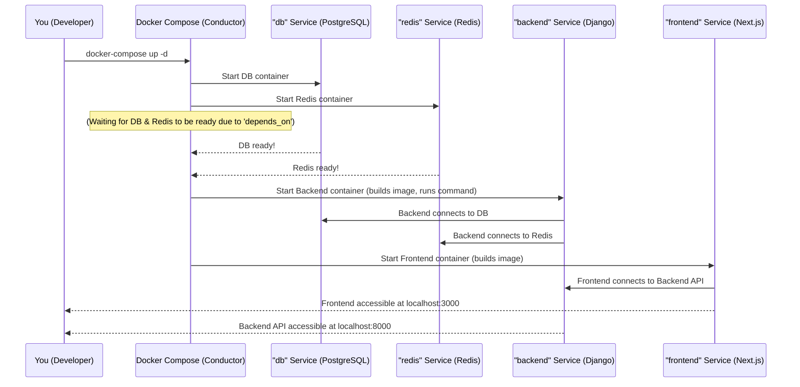

# Chapter 7: Docker Compose Orchestration (Application Manager)

In the previous chapters, we meticulously built out all the individual pieces of our `heritage-shipping-ltd` application: a beautiful [Frontend UI Components (Shadcn/UI Library)](01_frontend_ui_components__shadcn_ui_library__.md) (our user-facing website), a robust [Django REST API (Backend Communicator)](05_django_rest_api__backend_communicator__.md) (our data operations center), and a secure [Authentication System (User Identity & Access)](06_authentication_system__user_identity___access__.md) to protect it. We also have a database to store our information (PostgreSQL) and a fast cache (Redis) for background tasks.

That's a lot of separate pieces! Imagine building a magnificent ship, and all the different systems – the engine, the navigation, the communication, the power supply – are all separate, complex machines. How do you start them all up correctly, ensure they can talk to each other, and make sure they all work together seamlessly?

Manually starting each part of our web application (frontend server, backend server, database server, Redis server, background task workers) would be a complex, tedious, and error-prone process. This is exactly the problem that **Docker Compose Orchestration** solves for us.

### What Problem Does Docker Compose Solve?

Think of Docker Compose as the **conductor for an orchestra**. Our application is the orchestra, and each part – the frontend, the backend, the database, Redis, and Celery (for background tasks) – is a different section of instruments.

*   Without a conductor, each musician would try to play their part, but it would be chaos.
*   With a conductor, everyone knows when to start, how to interact with others, and when to stop, creating a beautiful symphony.

Docker Compose acts as this conductor. Instead of you manually starting the frontend server, then the backend API, then the database, then Redis, and then the background workers, Docker Compose uses a single configuration file (`docker-compose.yml`) to define all these "services" (our instruments) and their interdependencies. With one simple command, it brings up the entire multi-part application stack, ensuring everything runs correctly together in isolated environments.

This means less setup hassle for you, consistent environments for developers, and an easier path to deploying our `heritage-shipping-ltd` application.

### Core Concepts of Docker Compose

Let's break down how this "orchestra conductor" works:

#### 1. The `docker-compose.yml` File: The "Sheet Music"

The heart of Docker Compose is a special text file named `docker-compose.yml`. This file is like the sheet music for our application orchestra. It contains all the instructions for Docker Compose:
*   Which services (parts of the app) are there?
*   How to build or get each service.
*   How they should communicate.
*   What resources they need.

#### 2. Services: The Individual Musicians/Instruments

In Docker Compose, each part of your application (like the frontend, backend, database, or Redis) is called a **service**. Each service runs in its own isolated container, just like each musician plays their own instrument.

For `heritage-shipping-ltd`, our main services include:
*   `frontend`: Our Next.js website.
*   `backend`: Our Django API server.
*   `db`: Our PostgreSQL database.
*   `redis`: Our Redis cache server.
*   `celery` & `celery-beat`: Services for running background tasks.

#### 3. Ports: The "Stage Doors"

When services run inside Docker containers, they are isolated. To allow them to communicate with each other or with your computer's browser, we need to map their internal "ports" to ports on your computer. Think of it as opening a "stage door" so you can access the performance from outside.

For example, our frontend runs on port `3000` inside its container, and we map it to port `3000` on your computer: `3000:3000`.

#### 4. Volumes: The "Persistent Storage Rooms"

Containers are designed to be temporary. If a container stops or is removed, any data inside it is usually lost. For databases and other persistent data, this is a problem! **Volumes** are special directories that exist *outside* the container (on your computer's hard drive) but are "mounted" into the container. This ensures that even if the database container is removed, your precious data (like `heritage_shipping`'s shipment records) remains safe.

#### 5. `depends_on`: Ensuring the Right Order

Some services need others to be ready before they can start. Our `backend` needs the `db` (database) and `redis` services to be running before it can fully operate. The `depends_on` instruction tells Docker Compose: "Make sure these services are up and healthy *before* starting me." This is like the conductor ensuring the rhythm section is ready before the lead instruments begin.

#### 6. Environment Variables: Configuration Settings

Each service might need different configuration settings (e.g., database passwords, API URLs). **Environment variables** are a simple way to pass these settings into each service's container, ensuring they have the correct instructions for their operations.

### How to Use Docker Compose for `heritage-shipping-ltd`

The central use case for Docker Compose is to bring our entire `heritage-shipping-ltd` application online with just one command.

As described in the `SETUP_INSTRUCTIONS.md` file, after navigating to the project directory:

1.  **Start all services in the background:**
    ```bash
    docker-compose up -d
    ```
    **Explanation:**
    *   `docker-compose up`: This command tells Docker Compose to read your `docker-compose.yml` file and start all the services defined within it.
    *   `-d`: This flag means "detached mode," which runs the containers in the background, so your terminal remains free.

2.  **Setup the database (first time only):**
    ```bash
    docker-compose exec web python scripts/setup_production.py
    ```
    **Explanation:**
    *   `docker-compose exec web`: This runs a command inside the `web` service's container. (Note: in `docker-compose.yml` it's `backend`, in `docker-compose.prod.yml` it's `web`. For simple local setup using the default `docker-compose.yml` we'd use `docker-compose exec backend ...`)
    *   `python scripts/setup_production.py`: This runs a Python script that sets up the database, applies [Django Models (Data Blueprints)](04_django_models__data_blueprints__.md) (migrations), and creates initial user accounts.

Once these commands are run, Docker Compose orchestrates everything. You can then access:
*   Frontend: `http://localhost:3000`
*   Backend Admin: `http://localhost:8000/admin`

To stop all services:

```bash
docker-compose down
```
**Explanation:**
*   `docker-compose down`: This command gracefully stops and removes all the containers and networks created by `docker-compose up`.

### Under the Hood: The `docker-compose.yml` Blueprint

Let's look at the simplified `docker-compose.yml` file from the project to understand the "sheet music" that Docker Compose reads to manage our application.



The core of our Docker Compose configuration is in the `docker-compose.yml` file (for local development) and `docker-compose.prod.yml` (for production deployment). Let's examine parts of the `docker-compose.yml` file:

```yaml
# Simplified docker-compose.yml (from heritage-shipping-ltd project)
version: '3.8'

services:
  redis: # Our Redis cache service
    image: redis:7-alpine # Use a pre-built Redis image
    ports:
      - "6379:6379" # Map container port 6379 to host port 6379
    volumes:
      - redis_data:/data # Persist Redis data

  db: # Our PostgreSQL database service
    image: postgres:15 # Use a pre-built PostgreSQL image
    environment: # Environment variables for database credentials
      POSTGRES_DB: heritage_shipping
      POSTGRES_USER: postgres
      POSTGRES_PASSWORD: postgres
    volumes:
      - postgres_data:/var/lib/postgresql/data # Persist database data
    ports:
      - "5432:5432" # Map container port 5432 to host port 5432

  backend: # Our Django backend API service
    build: ./backend # Build the image from the Dockerfile in the './backend' directory
    ports:
      - "8000:8000" # Map container port 8000 to host port 8000
    environment: # Environment variables for backend configuration
      - DB_NAME=heritage_shipping
      - DB_USER=postgres
      - DB_PASSWORD=postgres
      - DB_HOST=db # Important: Use 'db' as the hostname, not 'localhost'!
      - DB_PORT=5432
      - REDIS_URL=redis://redis:6379/0 # Use 'redis' as the hostname
    depends_on: # Ensure these services are ready before starting backend
      - db
      - redis
    volumes:
      - ./backend:/app # Mount local backend code into the container for development
    command: > # Commands to run when the container starts
      sh -c "python manage.py migrate && # Apply database migrations
             python manage.py collectstatic --noinput && # Collect static files
             gunicorn --bind 0.0.0.0:8000 heritage_shipping.wsgi:application" # Start web server

  frontend: # Our Next.js frontend website service
    build: . # Build the image from the Dockerfile in the current directory (project root)
    ports:
      - "3000:3000" # Map container port 3000 to host port 3000
    environment:
      - NEXT_PUBLIC_API_URL=http://localhost:8000/api # Frontend needs backend API URL
    depends_on:
      - backend # Frontend needs backend to be ready

volumes: # Define named volumes for data persistence
  postgres_data:
  redis_data:
```

**Explanation of Key Sections:**

*   **`version: '3.8'`**: This specifies the Docker Compose file format version.
*   **`services:`**: This is where you define all the individual components of your application.

    *   **`redis` & `db` (PostgreSQL):**
        *   `image: redis:7-alpine` / `image: postgres:15`: This tells Docker Compose to pull a pre-built image from Docker Hub (a public repository of Docker images). This means you don't need to manually install Redis or PostgreSQL on your computer.
        *   `ports: - "6379:6379"`: Maps the container's port (`6379`) to your computer's port (`6379`), allowing your backend to connect to Redis on your machine. Similarly for `db` on port `5432`.
        *   `environment`: Sets up important variables like database name, username, and password for the `db` service.
        *   `volumes: - redis_data:/data`: This is our "persistent storage room." `redis_data` is a named volume (defined at the bottom of the file) that will keep Redis's data safe even if the container is recreated.

    *   **`backend` (Django API):**
        *   `build: ./backend`: Instead of pulling a pre-built image, this tells Docker Compose to *build* the Docker image for the backend using the `Dockerfile` found inside the `./backend` directory.
        *   `ports: - "8000:8000"`: Maps the backend API's internal port `8000` to your computer's port `8000`.
        *   `environment`: Provides crucial settings for the Django backend, such as how to connect to the `db` and `redis` services. Notice `DB_HOST=db` and `REDIS_URL=redis`. Docker Compose automatically sets up a network so services can talk to each other using their service names as hostnames.
        *   `depends_on: - db - redis`: Ensures that the database and Redis are running before the backend tries to start.
        *   `volumes: - ./backend:/app`: This is a very common setup for development. It "mounts" your local `backend` code directory (`./backend`) directly into the container's `/app` directory. This means any changes you make to your Python code on your computer are immediately reflected inside the running Docker container without needing to rebuild the image!
        *   `command`: Specifies the commands to run when the `backend` container starts. This applies database migrations, collects static files (for serving images, CSS, etc.), and then starts the Gunicorn web server that serves our Django [Django REST API (Backend Communicator)](05_django_rest_api__backend_communicator__.md).

    *   **`frontend` (Next.js Website):**
        *   `build: .`: Builds the frontend Docker image using the `Dockerfile` located in the root of the project (`.`).
        *   `ports: - "3000:3000"`: Maps the frontend's internal port `3000` to your computer's port `3000`.
        *   `environment: - NEXT_PUBLIC_API_URL=http://localhost:8000/api`: Tells the frontend (running inside its container) where to find the backend API.
        *   `depends_on: - backend`: Ensures the backend API is up before the frontend starts trying to talk to it.

*   **`celery` & `celery-beat`**: These services are also defined in the `docker-compose.yml`. They are responsible for running background tasks (like sending email notifications or processing long-running jobs) using the Celery library, connecting to Redis for message queuing and the database for scheduling. Their setup is similar to the `backend` service, connecting to `db` and `redis`.

*   **`volumes:`**: This section defines the named volumes (`postgres_data`, `redis_data`) that are used by the services above to store persistent data on your host machine.

The `docker-compose.prod.yml` file is very similar but is optimized for production environments. It uses a single `web` service (combining frontend and backend into one image), typically exposes ports 80/443 (for HTTP/HTTPS), and adds persistent volumes for static and media files that Django needs to serve.

### Conclusion

You've now mastered the concept of **Docker Compose Orchestration**, understanding how it acts as the "conductor" for our entire `heritage-shipping-ltd` application. We've seen how a single `docker-compose.yml` file serves as the "sheet music," defining all our application's services (frontend, backend, database, Redis, Celery), their network connections, shared data, and startup order. With simple commands like `docker-compose up -d`, you can now effortlessly launch and manage our complex multi-part application, making development and deployment a breeze!

This chapter concludes our tutorial on the core abstractions of the `heritage-shipping-ltd` project. You now have a comprehensive understanding of how its beautiful interface is built, how it communicates with a secure and structured backend, and how the entire system is orchestrated for smooth operation.

---

<sub><sup>**References**: [[1]](https://github.com/duttaturja-v2/heritage-shipping-ltd/blob/5b1bb363c463a5caff32e3a29cedf7676dfb34e4/Dockerfile), [[2]](https://github.com/duttaturja-v2/heritage-shipping-ltd/blob/5b1bb363c463a5caff32e3a29cedf7676dfb34e4/Dockerfile.prod), [[3]](https://github.com/duttaturja-v2/heritage-shipping-ltd/blob/5b1bb363c463a5caff32e3a29cedf7676dfb34e4/README.md), [[4]](https://github.com/duttaturja-v2/heritage-shipping-ltd/blob/5b1bb363c463a5caff32e3a29cedf7676dfb34e4/SETUP_INSTRUCTIONS.md), [[5]](https://github.com/duttaturja-v2/heritage-shipping-ltd/blob/5b1bb363c463a5caff32e3a29cedf7676dfb34e4/docker-compose.prod.yml), [[6]](https://github.com/duttaturja-v2/heritage-shipping-ltd/blob/5b1bb363c463a5caff32e3a29cedf7676dfb34e4/docker-compose.yml)</sup></sub>