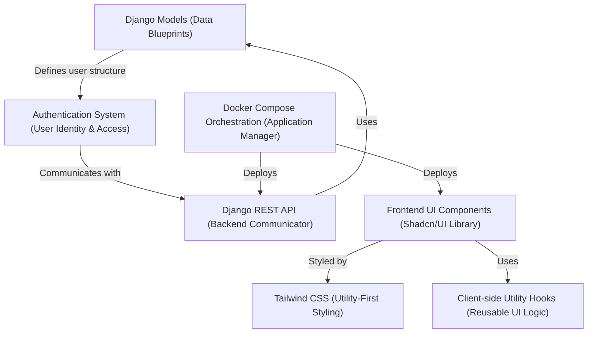

# Tutorial: heritage-shipping-ltd

Heritage Shipping Limited is a comprehensive full-stack web application designed for a maritime logistics company. It features a **Next.js frontend** for an interactive user experience and a **Django backend** to manage core business logic and data. Users can **track shipments**, *request quotes*, manage their profiles through an **authentication system**, and explore company services, vessels, and news. The entire application stack is easily managed and deployed using **Docker Compose**.

## Visual Overview

## Chapters

1. [Frontend UI Components (Shadcn/UI Library)
](01_frontend_ui_components__shadcn_ui_library__.md)
2. [Tailwind CSS (Utility-First Styling)
](02_tailwind_css__utility_first_styling__.md)
3. [Client-side Utility Hooks (Reusable UI Logic)
](03_client_side_utility_hooks__reusable_ui_logic__.md)
4. [Django Models (Data Blueprints)
](04_django_models__data_blueprints__.md)
5. [Django REST API (Backend Communicator)
](05_django_rest_api__backend_communicator__.md)
6. [Authentication System (User Identity & Access)
](06_authentication_system__user_identity___access__.md)
7. [Docker Compose Orchestration (Application Manager)
](07_docker_compose_orchestration__application_manager__.md)
